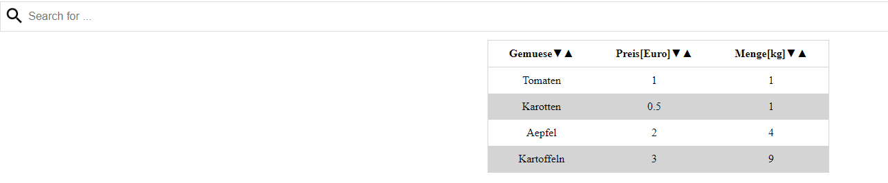

# Webview
A Table with some JS functions for an app. This Webapp could communictae with an android app over an interface.
Just played around a bit. 

## Getting Started
Clone the repository and open the index HTML.

## Built With
JS, HTML, CSS

## Main Focus of this project

The main File is the javascript file.
It contains the methods to build a HTML Table, provides methods for sorting, ...  

